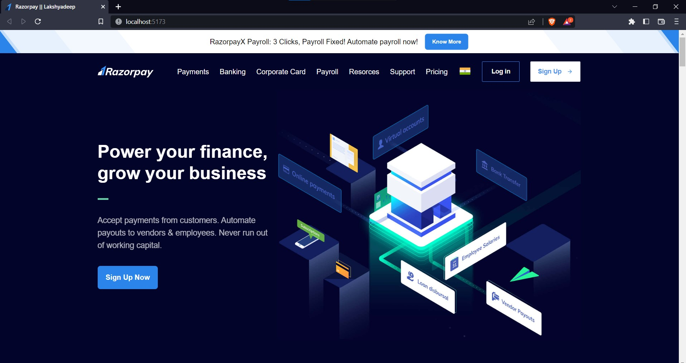
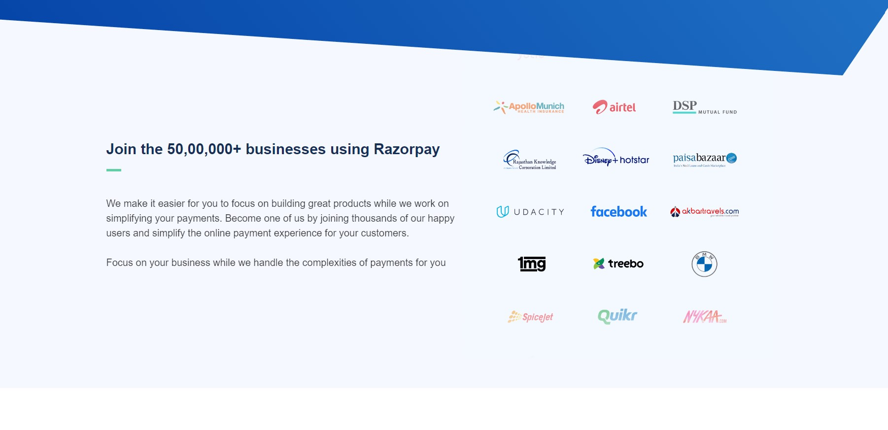

# Razorpay Clone

This is a clone of https://razorpay.com/, created for learning TailwindCSS , animation , flex box , grid and Responsive. The website is built using TailwindCSS, and is hosted on Netlify.

## Screenshots

## Getting Started

To get a copy of the project up and running on your local machine, simply follow these steps:

1. Clone the repository: `git clone https://github.com/your-username/website-clone.git`
2. Install the necessary dependencies: `npm install`
3. Start the development server: `npm start`

## Contributing

Contributions are always welcome! If you'd like to contribute to this project, please follow these steps:

1. Fork the repository
2. Create a new branch: `git checkout -b my-new-branch`
3. Make your changes
4. Commit your changes: `git commit -m 'Add some feature'`
5. Push your changes to your forked repository: `git push origin my-new-branch`
6. Create a pull request

## License

This project is licensed under the MIT License - see the [LICENSE.md](LICENSE.md) file for details.
